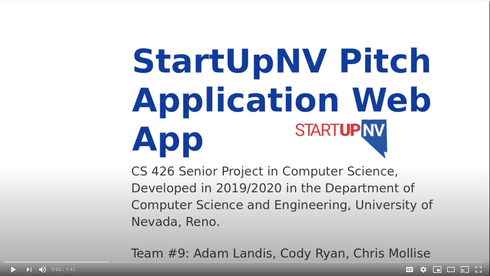
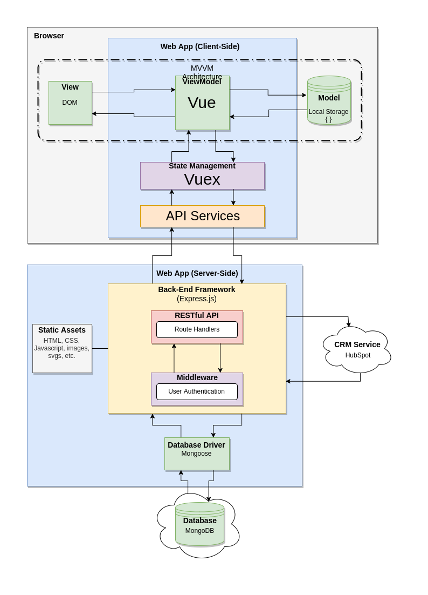
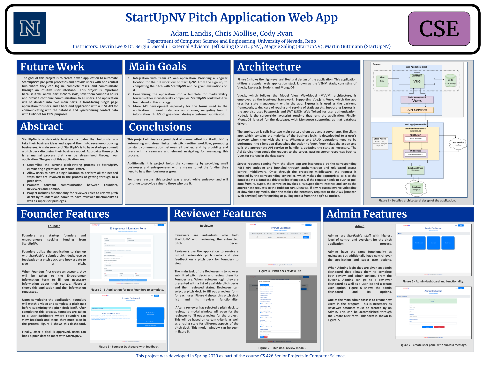

[Members](#members) \| [Instructors](#instructors) \| [Advisors](#advisors) \| [Project Video](#video) \| [Project Description](#description) \| [Architecture](#architecture) \| [Project Poster](#poster) \| [Problem Domain Book](#problem-domain-book) \| [Reference Articles](#reference-articles) \| [Project Related Websites](#project-related-websites)

### Members
- Adam Landis
- Chris Mollise
- Cody Ryan

### Instructors
- Devrin Lee
- Dr. Sergiu Dascalu

### External Advisors
- Jeff Saling (StartUpNV, Co-Founder, Executive Director)
- Maggie Saling (StartUpNV, Director of Communications)
- Martin Guttmann (StartUpNV, Product Manager)

### Project Video

### Project Description
The goal of this project is to create a web application to automate StartUpNV’s pre-pitch processes. It will provide a single dashboard for the Founders, Reviewers, Evaluators and Administrators (StartUpNV’s staff) that streamlines the fully manual process currently being used by StartUpNV, saving countless hours for the StartUpNV’s staff and providing continual communication to all users. This application aims to allow StartUpNV’s scaling to continue and to allow small businesses wishing to grow in the state of Nevada the ability to do so. The objective of this prototype document is to demonstrate the basic plan of the UI for the Founder role, as well as demonstrate a functioning site which allows individuals to sign up, login, and update their account.

### Architecture

The preceding image shows the high-level architectural design of the application. This application utilizes a popular web application stack known as the VENM stack, consisting of Vue.js, Express.js, Node.js and MongoDB.

Vue.js, which follows the Model View ViewModel (MVVM) architecture, is employed as the front-end framework. Supporting Vue.js is Vuex, which the app uses for state management within the app. Express.js is used as the back-end framework, taking care of routing and serving of static assets. Supporting Express.js, the app also uses Passport.js and JWT (JSON Web Token) for user authentication. Node.js is the server-side javascript runtime that runs the application. Finally, MongoDB is used for the database, with Mongoose supporting as that database driver.

The application is split into two main parts: a client app and a server app. The client app, which contains the majority of the business logic, is downloaded to a user’s browser when they visit the site. Whenever any CRUD operations need to be performed, the client app dispatches the action to Vuex. Vuex takes the action and calls the appropriate API service to handle it, updating the state as necessary. The Api Service then sends the request to the server, passing server responses back to Vuex for storage in the data store.

Server requests coming from the client app are intercepted by the corresponding REST API endpoint and funneled through authentication and role-based access control middleware. Once through the preceding middleware, the request is handled by the corresponding controller, which makes the appropriate calls to the database via a database driver called Mongoose. If the request needs to push or pull data from HubSpot, the controller invokes a HubSpot client instance and sends the appropriate requests to the HubSpot API. Likewise, if any requests involve uploading or downloading media, then the makes the necessary requests to the AWS (Amazon Web Services) API for pushing or pulling media from the app’s S3 Bucket.

### Project Poster

### Project Related Resources
#### Problem Domain Book
Full-Stack Web Development with Vue.js and Node
Aneeta Sharma: A software developer from Nepal, she’s made a career as a Web Designer, PHP Developer and now a Ruby on Rails engineer. This book dives into her expertise working on both frontend and backend aspects of a web application development. It goes over working with a MEVN development stack consisting of the use of MongoDB, Express.js, Vue.js, and Node.js.
 
Get Backed: Craft Your Story, Build the Perfect Pitch Deck, and Launch the Venture of Your Dreams
Successful entrepreneurs Evan Loomis and Evan Baehr describe the process of preparing a pitch deck as well as the processes necessary to raise a startup from the ground floor. This book gives helpful information that can be utilized for understanding the pitch process and how users of the app will be preparing their pitch deck.
 
MongoDB: The Definitive Guide: Powerful and Scalable Data Storage
Kristina Chodorow, a core contributor to MongoDB, describes the process of using MongoDB to manage user data and create scalability. This book covers the core concepts of MongoDB as well as the process of creating an app with MongoDB integration. This book will be a helpful resource in understanding and implementing the storage of user data.

#### Reference Articles
Charles Y.Murnieks, “Drawn to the fire: The role of passion, tenacity and inspirational leadership in angel investing”
[https://www.sciencedirect.com/science/article/pii/S0883902616300180](https://www.sciencedirect.com/science/article/pii/S0883902616300180)
 
This article goes into detail about the role of angel investors and the impact they can have on a small business. This journal gives important information into how angel investors work and how StartUpNV affect their founders through angel investment.
 
Stefan Tilkov, “Node.js: Using JavaScript to Build High-Performance Network Programs”
[https://search.proquest.com/docview/761013661?pq-origsite=summon&https://search.proquest.com/advancedtechaerospace](https://search.proquest.com/docview/761013661?pq-origsite=summon&https://search.proquest.com/advancedtechaerospace)
 
This article describes the benefits and process of using Node.js. This will be instrumental in our project as Node will be used in conjunction with javascript to operate many functions of the website. The article takes a ground up approach in explaining its benefits and how it can be used making it easier for less experienced programmers to understand Node’s underlying function.
 
Rizik Al-Sayyed, “An Investigation of Microsoft Azure and Amazon Web Services from Users' Perspectives”
[https://web.b.ebscohost.com/ehost/detail/detail?vid=0&sid=300d1715-91a3-400d-b43c-f8660af48642%40sessionmgr103&bdata=JnNpdGU9ZWhvc3QtbGl2ZSZzY29wZT1zaXRl#AN=136737737&db=eue](https://web.b.ebscohost.com/ehost/detail/detail?vid=0&sid=300d1715-91a3-400d-b43c-f8660af48642%40sessionmgr103&bdata=JnNpdGU9ZWhvc3QtbGl2ZSZzY29wZT1zaXRl#AN=136737737&db=eue)
 
This article describes two cloud computing platforms through Microsoft Azure and Amazon Web Services. This article is helpful in describing the benefits of Amazon Web Services and how we can use the platform effectively for our project. 

#### Project Related Websites
Matt Maribojoc, “Creating a ToDo App with a MEVN Full Stack” Part1 and Part 2
[https://medium.com/@mattmaribojoc/creating-a-todo-app-with-a-mevn-full-stack-part-1-da0f4df7e15](https://medium.com/@mattmaribojoc/creating-a-todo-app-with-a-mevn-full-stack-part-1-da0f4df7e15)
[https://medium.com/@mattmaribojoc/creating-a-todo-app-with-a-mevn-full-stack-part-2-8180d944233a](https://medium.com/@mattmaribojoc/creating-a-todo-app-with-a-mevn-full-stack-part-2-8180d944233a)
 
This is a step-by-step walkthrough of how to set up a basic MEVN Full Stack Web application. These guides will help create a foundation for the project and allow for further expansion to encompass all aspects of the project. It even covers some basics about HTML coding in there as well.
 
Krunal Laythiya, “MEVN Stack Tutorial With Example From Scratch”
[https://appdividend.com/2018/11/21/mevn-stack-tutorial-with-example-from-scratch/](https://appdividend.com/2018/11/21/mevn-stack-tutorial-with-example-from-scratch/)
 
This example is another walkthrough but this time it is for a single page application using MongoDB, Express, Vue, and Node.js. This one walks the reader through the creation of a Vue.js project, installing dependencies, manufacturing Vue components, creating a backend with Node.js, how to connect and set up the MongoDB database, network requests and much more.
 
HubSpot API Overview
[https://developers.hubspot.com/docs/overview](https://developers.hubspot.com/docs/overview)
 
This is a reference page that will be essential for any API management we develop for the project. It gives a guideline for API usage, testing, authentication, developer tools and an arrangement of API documentation. Upon creating a developer account, the group will also have access to a developer forum so if problems arise for the group, there is a good chance someone else has asked about it. 
 
Mongoose
[https://mongoosejs.com/](https://mongoosejs.com/)
This is the Mongoose.js official website. It provides extensive documentation for working with Mongoose and integrating it into an application. This library provides a simpler way to deal with defining the structure and validation of MongoDB collections.
